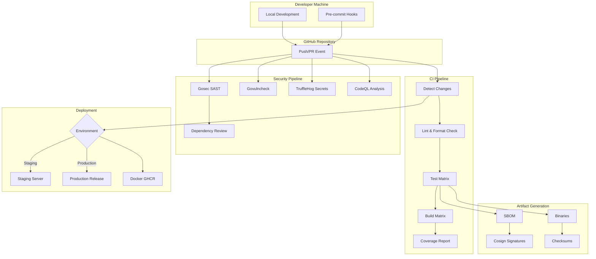
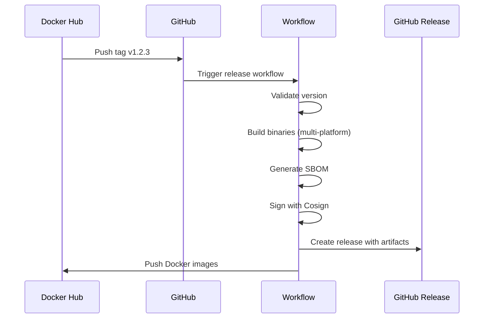

# L.S.D CI/CD Architecture

## Overview

This document describes the comprehensive CI/CD architecture for L.S.D (Large Search of Data), designed following 2026 industry best practices for security, reliability, and developer experience.

## Architecture Diagram



## Pipeline Components

### 1. Continuous Integration (CI)

**File:** `.github/workflows/ci.yml`

#### Purpose
Validates code quality and functionality on every push and pull request.

#### Workflow Triggers
- `push` to `main`, `development`, `testing`, `beta`, or `staging` branches
- `pull_request` targeting `main`, `development`, `testing`, `beta`, or `staging`
- `workflow_dispatch` for manual runs

#### Jobs

| Job | Purpose | Runs On |
|-----|---------|---------|
| `changes` | Detect file changes for smart execution | ubuntu-latest |
| `lint` | golangci-lint code quality check | ubuntu-latest |
| `test` | Multi-version, multi-OS testing | ubuntu/macos |
| `coverage` | Upload to Codecov | ubuntu-latest |
| `build` | Cross-platform binary compilation | ubuntu-latest |
| `web-validation` | Validate web assets | ubuntu-latest |
| `ci-status` | Final status aggregation | ubuntu-latest |

#### Test Matrix

```yaml
strategy:
  matrix:
    go: ['1.24.x', '1.22.x']  # Stable + LTS
    os: [ubuntu-latest, macos-latest]
```

#### Caching Strategy

- Go modules: `~/.cache/go-build`
- golangci-lint: `~/.cache/golangci-lint`
- Key format: `{tool}-{os}-{version}-{go.sum hash}`

### 2. Security Pipeline

**File:** `.github/workflows/security.yml`

#### Purpose
Comprehensive security scanning including SAST, dependency, and secret detection.

#### Scanning Tools

| Tool | Purpose | Fail Condition |
|------|---------|----------------|
| Gosec | Go SAST | Medium+ severity |
| Govulncheck | Go vulnerabilities | Any vulnerability |
| TruffleHog | Secret detection | Verified secrets |
| CodeQL | Semantic analysis | High+ severity |
| Dependabot | Dependency updates | N/A (automated) |

#### Schedule
- Daily at 02:00 UTC for proactive security monitoring
- On every push for immediate feedback

#### SBOM Generation

Uses Syft to generate Software Bill of Materials in multiple formats:
- SPDX JSON
- CycloneDX JSON

### 3. Release Pipeline

**File:** `.github/workflows/release.yml`

#### Purpose
Automated release creation when version tags are pushed.

#### Release Flow



#### Build Platforms

| OS | Architecture | Output |
|----|--------------|--------|
| Linux | amd64 | `lsd-linux-amd64` |
| Linux | arm64 | `lsd-linux-arm64` |
| macOS | amd64 | `lsd-darwin-amd64` |
| macOS | arm64 | `lsd-darwin-arm64` |
| Windows | amd64 | `lsd-windows-amd64.exe` |

#### Signing

All release artifacts are signed using Sigstore Cosign for supply chain security:
- Binary signatures (`.sig` files)
- Docker image signatures

### 4. Deployment Pipeline

**File:** `.github/workflows/deploy.yml`

#### Purpose
Automated deployments to staging and production environments.

#### Environment Strategy

| Environment | Trigger | Approval |
|-------------|---------|----------|
| Development | Push to `development` branch | Automatic |
| Testing | Push to `testing` branch | Automatic |
| Beta | Push to `beta` branch | Automatic |
| Staging | Push to `main` or `staging` branch | Automatic |
| Production | Release published | Manual (via GitHub) |

#### Branch to Environment Mapping

| Branch | Deploys To | Docker Tag |
|--------|------------|------------|
| `development` | Development | `development`, `sha-{commit}` |
| `testing` | Testing | `testing`, `sha-{commit}` |
| `beta` | Beta | `beta`, `sha-{commit}` |
| `staging` | Staging | `staging`, `sha-{commit}` |
| `main` | Staging | `staging`, `sha-{commit}` |
| Tag `v*` | Production | `{version}`, `latest` |

#### Deployment Targets

- **Development**: Docker image tagged with `development` and `sha-{commit}`
- **Testing**: Docker image tagged with `testing` and `sha-{commit}`
- **Beta**: Docker image tagged with `beta` and `sha-{commit}`
- **Staging**: Docker image tagged with `staging` and `sha-{commit}`
- **Production**: Docker image with semantic version tags

## Security Tool Rationale

### Why These Tools?

| Tool | Reason for Selection |
|------|---------------------|
| **Gosec** | Go-specific SAST, lightweight, low false positives |
| **Govulncheck** | Official Go vulnerability checker, accurate CVE matching |
| **TruffleHog** | Detects secrets with verified validation |
| **CodeQL** | Deep semantic analysis, GitHub native |
| **Syft** | Industry-standard SBOM generation |
| **Cosign** | Keyless signing with Sigstore, no key management overhead |

### Security Gates

All security scans must pass before code can be merged:

```yaml
# Branch protection rule requirements
required_status_checks:
  - ci / lint
  - ci / test (1.24.x, ubuntu-latest)
  - security / gosec
  - security / govulncheck
  - security / trufflehog
```

## Local Development

### Running CI Checks Locally

```bash
# Full CI simulation
make ci

# Individual checks
make lint          # golangci-lint
make test          # go test with race
make test-coverage # Coverage report
make security      # All security scans
make build         # Cross-platform build
```

### Pre-commit Hooks

Install pre-commit hooks for local validation:

```bash
# Install pre-commit
pip install pre-commit

# Install hooks
pre-commit install

# Run on all files
pre-commit run --all-files
```

### Security Tools Installation

```bash
# Gosec
go install github.com/securego/gosec/v2/cmd/gosec@latest

# Govulncheck
go install golang.org/x/vuln/cmd/govulncheck@latest

# Syft (for SBOM)
curl -sSfL https://raw.githubusercontent.com/anchore/syft/main/install.sh | sh -s -- -b /usr/local/bin

# Cosign
go install github.com/sigstore/cosign/v2/cmd/cosign@latest
```

## Secret Management

### Secrets Used in CI/CD

| Secret | Purpose | Rotation Policy |
|--------|---------|-----------------|
| `GITHUB_TOKEN` | Built-in, temporary | Automatic |
| `CODECOV_TOKEN` | Coverage upload | Yearly |
| `Cosign Key` | Artifact signing | As needed |

### Rotation Process

1. Generate new secret/credential
2. Update GitHub repository secrets
3. Revoke old secret after verifying new works
4. Document rotation date in security log

### Best Practices

- Never commit secrets to repository
- Use GitHub environments for production secrets
- Enable branch protection for main/develop
- Require PR reviews for sensitive changes

## Release Process

### Creating a Release

1. **Prepare Release Branch**
   ```bash
   git checkout development
   git pull origin development
   git checkout -b release/v2.1.0
   ```

2. **Update Version**
   - Update version in code
   - Update CHANGELOG.md
   - Commit changes

3. **Create Tag**
   ```bash
   git tag -a v2.1.0 -m "Release v2.1.0"
   git push origin v2.1.0
   ```

4. **Automated Process**
   - Workflow builds all artifacts
   - Creates GitHub Release
   - Publishes Docker images

### Changelog Generation

Changelogs are automatically generated from git commit history:
- Groups commits by conventional commit type
- Lists contributors
- Links to comparison view

## Future Improvements

### Recommended Enhancements

| Enhancement | Priority | Description |
|-------------|----------|-------------|
| **SLSA Level 3** | High | Add provenance attestations |
| **OPA Policies** | Medium | Policy-as-code for deployments |
| **Fuzz Testing** | Medium | Go native fuzzing integration |
| **E2E Tests** | High | Full integration test suite |
| **Multi-arch Tests** | Low | QEMU-based cross-arch testing |

### SLSA Compliance

Current compliance: **SLSA Level 2**

To achieve Level 3:
- Add build provenance attestations
- Implement hermetic builds
- Add non-falsifiable provenance

### Observability

Pipeline status is available through:
- GitHub Actions UI
- Status badges in README
- Deployment status API
- GitHub Security tab

## Troubleshooting

### Common Issues

| Issue | Solution |
|-------|----------|
| Lint failures | Run `golangci-lint run --fix` locally |
| Test timeouts | Increase timeout or optimize slow tests |
| Coverage drop | Add tests for new code |
| Security scan fail | Review and fix reported issues |

### Debug Mode

Enable debug logging in workflows:

```yaml
env:
  ACTIONS_STEP_DEBUG: true
  ACTIONS_RUNNER_DEBUG: true
```

---

**Document Version:** 1.0  
**Last Updated:** 2026  
**Maintainer:** @Daveshvats
