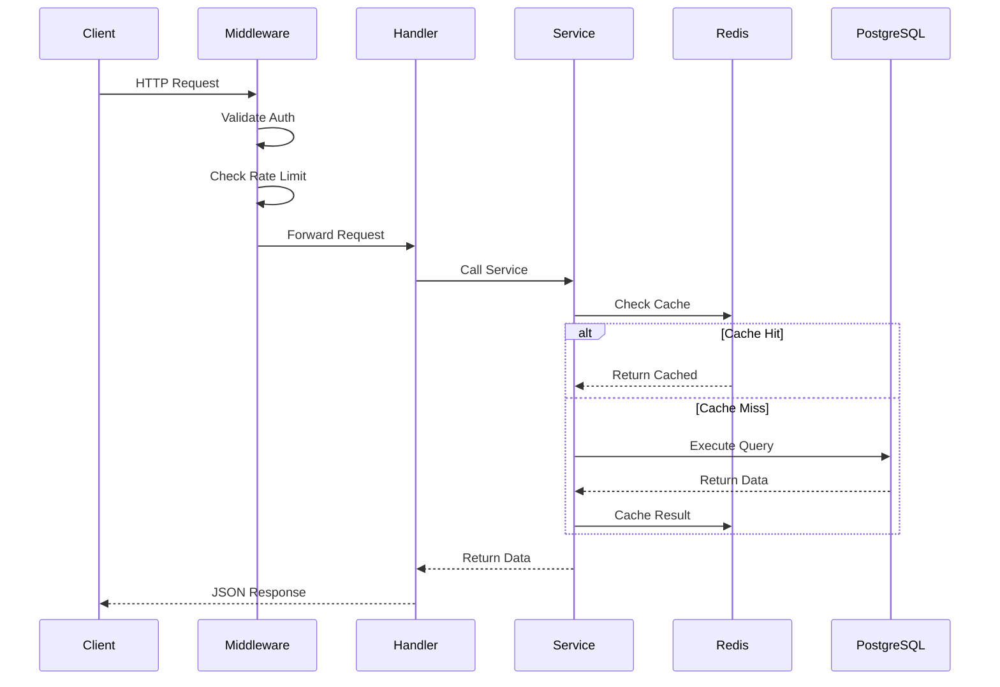
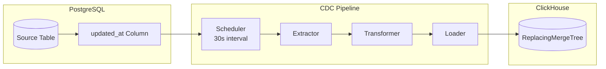

# Architecture Guide

This document provides a comprehensive overview of L.S.D's architecture, design decisions, and component interactions.

## Table of Contents

- [Overview](#overview)
- [Core Principles](#core-principles)
- [System Architecture](#system-architecture)
- [Component Details](#component-details)
- [Data Flow](#data-flow)
- [Search Architecture](#search-architecture)
- [CDC Pipeline](#cdc-pipeline)
- [Authentication & Authorization](#authentication--authorization)
- [Caching Strategy](#caching-strategy)
- [Performance Considerations](#performance-considerations)

## Overview

L.S.D (Large Search of Data) is designed as a **schema-agnostic, high-performance API layer** that sits between clients and a PostgreSQL database. Its primary purpose is to eliminate the need for writing boilerplate CRUD APIs while providing enterprise-grade features like full-text search, caching, and real-time synchronization.

### Design Philosophy

The architecture follows these key principles:

1. **Zero Configuration** - The system auto-discovers database schema at runtime, requiring no manual mapping or configuration files
2. **Performance First** - Every component is designed for sub-second response times, even on terabyte-scale datasets
3. **Graceful Degradation** - Optional components like ClickHouse and Redis enhance performance but are not required for core functionality
4. **Security by Default** - Strict input validation, parameterized queries, and role-based access control are built into the core

## Core Principles

### Schema Discovery at Runtime

Unlike traditional ORMs that require model definitions, L.S.D queries PostgreSQL's metadata tables (`information_schema`, `pg_catalog`) at startup to discover:

- All user-defined tables (excluding system catalogs)
- Column names, data types, and nullability
- Primary key columns (including composite keys)
- Leading indexed columns for safe filtering
- Text columns for search functionality

```go
// Simplified schema discovery process
func (l *Loader) DiscoverSchema() error {
    // Query all user tables
    tables := l.queryTables()

    for _, table := range tables {
        // Get columns and types
        columns := l.queryColumns(table)

        // Identify primary keys
        pkColumns := l.queryPrimaryKeys(table)

        // Find indexed columns
        indexedCols := l.queryIndexedColumns(table)

        // Cache schema in memory
        l.cache[table] = TableSchema{
            Columns:    columns,
            PrimaryKey: pkColumns,
            Indexed:    indexedCols,
        }
    }
    return nil
}
```

### Type-Aware Cursor Pagination

Traditional OFFSET pagination degrades linearly with dataset size. L.S.D uses **keyset (cursor-based) pagination** with O(1) performance at any scale. The cursor is a base64-encoded JSON structure containing the last row's primary key values.

```json
{
  "values": ["2024-01-15T10:30:00Z", 12345],
  "types": ["timestamp", "integer"]
}
```

This design handles:

- Single and composite primary keys
- Mixed data types (timestamps, integers, UUIDs, text)
- Cursor validation to prevent pagination state bleed

### Whitelisted Column Access

Security is enforced at the query builder level. Only **leading indexed columns** can be used for:

- `WHERE` clause filtering
- `ORDER BY` sorting

This prevents full table scans from poorly written queries and ensures predictable performance.

## System Architecture

```
┌─────────────────────────────────────────────────────────────────────┐
│                          CLIENT LAYER                                │
│  ┌──────────┐  ┌──────────┐  ┌──────────┐  ┌──────────┐            │
│  │   Web    │  │ Telegram │  │ WhatsApp │  │   API    │            │
│  │Dashboard │  │   Bot    │  │   Bot    │  │Consumers │            │
│  └────┬─────┘  └────┬─────┘  └────┬─────┘  └────┬─────┘            │
└───────┼─────────────┼─────────────┼─────────────┼──────────────────┘
        │             │             │             │
        ▼             ▼             ▼             ▼
┌─────────────────────────────────────────────────────────────────────┐
│                        API GATEWAY LAYER                             │
│  ┌──────────────┐  ┌──────────────┐  ┌──────────────┐               │
│  │   Auth       │──▶│ Rate Limiter │──▶│  CORS/Logs  │               │
│  │ (JWT/API Key)│  │ (100-5000/min)│  │              │               │
│  └──────────────┘  └──────────────┘  └──────────────┘               │
└─────────────────────────────────────────────────────────────────────┘
                                   │
                                   ▼
┌─────────────────────────────────────────────────────────────────────┐
│                       APPLICATION LAYER                              │
│  ┌─────────────┐  ┌─────────────┐  ┌─────────────┐                  │
│  │  Schema     │  │  Dynamic    │  │   Search    │                  │
│  │  Discovery  │  │  Handlers   │  │   Engine    │                  │
│  └──────┬──────┘  └──────┬──────┘  └──────┬──────┘                  │
│         │                │                │                         │
│         │         ┌──────┴──────┐         │                         │
│         │         │   Service   │         │                         │
│         │         │    Layer    │         │                         │
│         │         └──────┬──────┘         │                         │
│         │                │                │                         │
│  ┌──────┴────────────────┴────────────────┴──────┐                  │
│  │                CDC Pipeline                    │                  │
│  └───────────────────────────────────────────────┘                  │
└─────────────────────────────────────────────────────────────────────┘
                                   │
                                   ▼
┌─────────────────────────────────────────────────────────────────────┐
│                         DATA LAYER                                   │
│  ┌──────────────┐  ┌──────────────┐  ┌──────────────┐               │
│  │  PostgreSQL  │  │  ClickHouse  │  │    Redis     │               │
│  │  (Primary)   │◀─│   (Search)   │  │   (Cache)    │               │
│  │              │  │              │  │   30s TTL    │               │
│  └──────────────┘  └──────────────┘  └──────────────┘               │
└─────────────────────────────────────────────────────────────────────┘
```

## Component Details

### Entry Point (`cmd/api/main.go`)

The application entry point orchestrates initialization:

```go
func main() {
    // Load configuration
    cfg := config.Load()

    // Initialize database pool
    dbPool := database.NewPool(cfg.DatabaseURL)

    // Discover schema
    schemaLoader := schema.NewLoader(dbPool)
    tables := schemaLoader.Discover()

    // Initialize cache (optional)
    cache := cache.NewRedisCache(cfg.RedisAddr)

    // Initialize ClickHouse (optional)
    chClient := clickhouse.NewClient(cfg.ClickHouseAddr)

    // Start CDC pipeline (background)
    cdc := pipeline.NewCDC(dbPool, chClient)
    go cdc.Start()

    // Setup HTTP server
    server := handlers.NewServer(dbPool, cache, chClient, tables)
    server.Start(cfg.Port)
}
```

### Internal Packages Structure

| Package | Purpose | Key Files |
|---------|---------|-----------|
| `internal/auth` | JWT & API key authentication | `jwt.go`, `api_key.go`, `middleware.go` |
| `internal/cache` | Redis caching layer | `redis.go` |
| `internal/clickhouse` | ClickHouse integration | `connection.go`, `search.go`, `cdc.go` |
| `internal/config` | Configuration management | `config.go` |
| `internal/database` | PostgreSQL operations | `pool.go`, `repository.go` |
| `internal/handlers` | HTTP request handlers | `dynamic.go`, `auth.go`, `bot.go` |
| `internal/middleware` | Request middleware | `rate_limit.go`, `auth.go`, `logging.go` |
| `internal/models` | Data structures | `models.go` |
| `internal/pagination` | Cursor pagination | `cursor.go`, `encoder.go` |
| `internal/pipeline` | CDC pipeline | `cdc.go`, `sync.go` |
| `internal/schema` | Schema discovery | `loader.go`, `query_builder.go` |
| `internal/services` | Business logic | `record_service.go` |
| `internal/utils` | Utility functions | `utils.go` |

### Handler Layer

The `internal/handlers` package implements dynamic REST endpoints that work with any discovered table:

```go
// Dynamic table listing
func (h *Handler) ListTables(w http.ResponseWriter, r *http.Request) {
    tables := h.schema.GetAllTables()
    respondJSON(w, tables)
}

// Dynamic record listing with pagination
func (h *Handler) ListRecords(w http.ResponseWriter, r *http.Request) {
    tableName := chi.URLParam(r, "table")
    cursor := r.URL.Query().Get("cursor")
    limit := parseLimit(r.URL.Query().Get("limit"))

    // Build query with cursor pagination
    query := h.queryBuilder.BuildSelect(tableName, cursor, limit)

    // Execute with streaming
    rows, err := h.db.Query(r.Context(), query)
    // ... process and respond
}

// Multi-column search
func (h *Handler) SearchRecords(w http.ResponseWriter, r *http.Request) {
    tableName := chi.URLParam(r, "table")
    searchTerm := r.URL.Query().Get("q")
    engine := r.URL.Query().Get("engine") // auto, clickhouse, postgresql

    // Route to appropriate search backend
    if h.clickhouse != nil && engine != "postgresql" {
        results := h.search.ClickHouseSearch(tableName, searchTerm)
        respondJSON(w, results)
        return
    }

    // Fallback to PostgreSQL
    results := h.search.PostgresSearch(tableName, searchTerm)
    respondJSON(w, results)
}
```

## Data Flow

### Standard Request Flow



### Search Request Flow

When a search request arrives, the system first attempts to use ClickHouse for accelerated search. If ClickHouse is unavailable or explicitly bypassed, it falls back to PostgreSQL ILIKE queries.

## Search Architecture

### ClickHouse Integration

L.S.D uses ClickHouse as an optional search acceleration layer with the following characteristics:

**Table Structure:**

```sql
CREATE TABLE search_index (
    -- Primary key from source table
    id String,
    -- All text columns concatenated for search
    search_text String,
    -- Ngram index for fast text search
    INDEX ngram_idx search_text TYPE ngrambf_v1(4, 65536, 2, 0) GRANULARITY 1,
    -- Timestamp for CDC sync tracking
    updated_at DateTime,
    -- Tombstone flag for soft deletes
    is_deleted UInt8 DEFAULT 0
) ENGINE = ReplacingMergeTree(updated_at)
ORDER BY id;
```

**Search Query:**

```sql
SELECT id, search_text
FROM search_index
WHERE search_text ILIKE '%term1%'
   OR search_text ILIKE '%term2%'
ORDER BY updated_at DESC
LIMIT 50;
```

### Multi-Token Search

When a user searches for "John Smith", the system:

1. Tokenizes the query into ["John", "Smith"]
2. Searches each token across all text columns
3. Returns records matching ANY token (OR logic)
4. Ranks results by relevance (more matches = higher rank)

### PostgreSQL Fallback

When ClickHouse is unavailable, the system generates ILIKE queries:

```sql
SELECT *
FROM users
WHERE name ILIKE '%john%'
   OR email ILIKE '%john%'
   OR name ILIKE '%smith%'
   OR email ILIKE '%smith%'
ORDER BY id
LIMIT 50;
```

## CDC Pipeline

The Change Data Capture pipeline synchronizes data from PostgreSQL to ClickHouse for search indexing.

### Architecture



### Sync Process

1. **Extract**: Query records modified since last sync
   ```sql
   SELECT * FROM source_table
   WHERE updated_at > :last_sync_time
   ORDER BY updated_at
   LIMIT :batch_size;
   ```

2. **Transform**: Convert to ClickHouse-compatible format
   - Concatenate text columns into `search_text`
   - Add `is_deleted = 0` flag

3. **Load**: Insert into ClickHouse ReplacingMergeTree
   ```sql
   INSERT INTO search_index (id, search_text, updated_at, is_deleted)
   VALUES (?, ?, ?, 0);
   ```

### Delete Handling

Deletes are tracked via a separate process:

1. When a record is deleted in PostgreSQL, the CDC inserts a tombstone:
   ```sql
   INSERT INTO search_index (id, search_text, updated_at, is_deleted)
   VALUES (?, '', NOW(), 1);
   ```

2. ClickHouse's ReplacingMergeTree automatically deduplicates based on the latest `updated_at`

## Authentication & Authorization

### JWT Authentication

Standard user authentication uses JWT tokens with refresh token rotation:

```go
type Claims struct {
    UserID   int      `json:"user_id"`
    Email    string   `json:"email"`
    Username string   `json:"username"`
    Role     string   `json:"role"`
    jwt.RegisteredClaims
}

// Token generation
func GenerateToken(user User) (string, error) {
    claims := Claims{
        UserID:   user.ID,
        Email:    user.Email,
        Username: user.Username,
        Role:     user.Role,
        RegisteredClaims: jwt.RegisteredClaims{
            ExpiresAt: jwt.NewNumericDate(time.Now().Add(15 * time.Minute)),
        },
    }
    return jwt.NewWithClaims(jwt.SigningMethodHS256, claims).SignedString(secret)
}
```

### API Key Authentication

For AI agents and automated systems:

```go
type APIKey struct {
    ID          string    `json:"id"`
    UserID      int       `json:"user_id"`
    KeyPrefix   string    `json:"key_prefix"`   // "lsd_live_"
    KeyHash     string    `json:"key_hash"`     // SHA-256 hash
    Scopes      []string  `json:"scopes"`       // ["read", "search"]
    RateLimit   int       `json:"rate_limit"`   // requests per minute
    LastUsedAt  time.Time `json:"last_used_at"`
}

// Validation
func ValidateAPIKey(key string) (*APIKey, error) {
    if !strings.HasPrefix(key, "lsd_live_") {
        return nil, ErrInvalidKeyFormat
    }
    hash := sha256.Sum256([]byte(key))
    return repository.FindByKeyHash(hex.EncodeToString(hash[:]))
}
```

### Scopes

| Scope | Description | Endpoints |
|-------|-------------|-----------|
| `read` | Read table data | `/api/tables/*` |
| `write` | Create/update records | POST, PUT, DELETE (future) |
| `search` | Full-text search | `/api/tables/*/search` |
| `pipeline` | CDC management | `/api/cdc/*` |
| `admin` | Full access | All endpoints |

## Caching Strategy

### Redis Cache Implementation

```go
type Cache struct {
    client *redis.Client
    ttl    time.Duration // Default: 30 seconds
}

func (c *Cache) Get(ctx context.Context, key string) ([]byte, bool) {
    val, err := c.client.Get(ctx, key).Bytes()
    if err != nil {
        return nil, false
    }
    return val, true
}

func (c *Cache) Set(ctx context.Context, key string, val []byte) {
    c.client.Set(ctx, key, val, c.ttl)
}

// Cache key format: "table:records:{table}:{cursor}:{filters}"
func buildCacheKey(table, cursor string, filters map[string]string) string {
    filterStr := sortedFilterString(filters)
    return fmt.Sprintf("table:records:%s:%s:%s", table, cursor, filterStr)
}
```

### Cache Invalidation

Since L.S.D is primarily read-heavy with short TTL:

- **Automatic expiration**: All keys expire after 30 seconds (configurable)
- **Write-through**: Future write operations will invalidate affected keys
- **Prefix invalidation**: Admin endpoint to clear all cache for a table

## Performance Considerations

### Query Optimization

1. **Explicit column selection** - Never `SELECT *`
2. **Keyset pagination** - Never `OFFSET`
3. **Streaming rows** - Use `pgx.Rows` iterator to avoid memory bloat
4. **Prepared statements** - Cache query plans for repeated patterns
5. **Connection pooling** - PgBouncer-compatible transaction pooling

### Memory Management

```go
// Stream rows instead of loading all into memory
func StreamRecords(ctx context.Context, query string) <-chan Record {
    rows, _ := db.Query(ctx, query)
    ch := make(chan Record, 100)

    go func() {
        defer close(ch)
        defer rows.Close()
        for rows.Next() {
            var r Record
            rows.Scan(&r.Fields...)
            ch <- r
        }
    }()

    return ch
}
```

### Connection Pooling

```go
poolConfig := pgxpool.Config{
    ConnConfig: connConfig,
    MaxConns:           50,    // Maximum connections
    MinConns:           5,     // Minimum idle connections
    MaxConnLifetime:    time.Hour,
    MaxConnIdleTime:    30 * time.Minute,
    HealthCheckPeriod:  time.Minute,
}
```

### Benchmarked Performance

| Operation | Dataset Size | Response Time |
|-----------|--------------|---------------|
| List tables | Any | < 1ms |
| Get schema | Any | < 1ms |
| List records (cached) | Any | < 5ms |
| List records (uncached) | 1M rows | < 50ms |
| List records (uncached) | 1B rows | < 100ms |
| Search (ClickHouse) | 1B rows | < 200ms |
| Search (PostgreSQL) | 1M rows | < 500ms |
| Search (PostgreSQL) | 1B rows | 2-10s |

---

**Next**: [Setup Guide](setup.md) | [Configuration](configuration.md)
