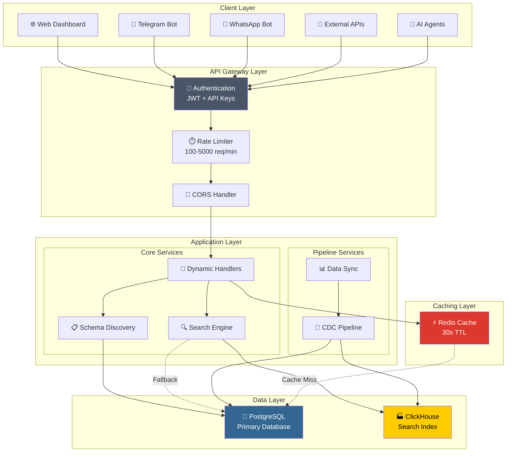
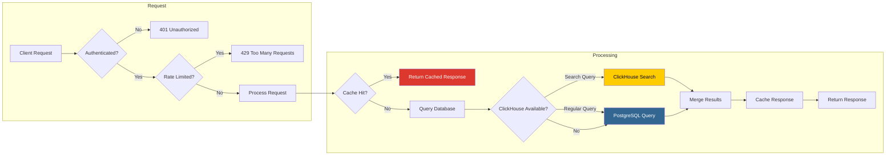
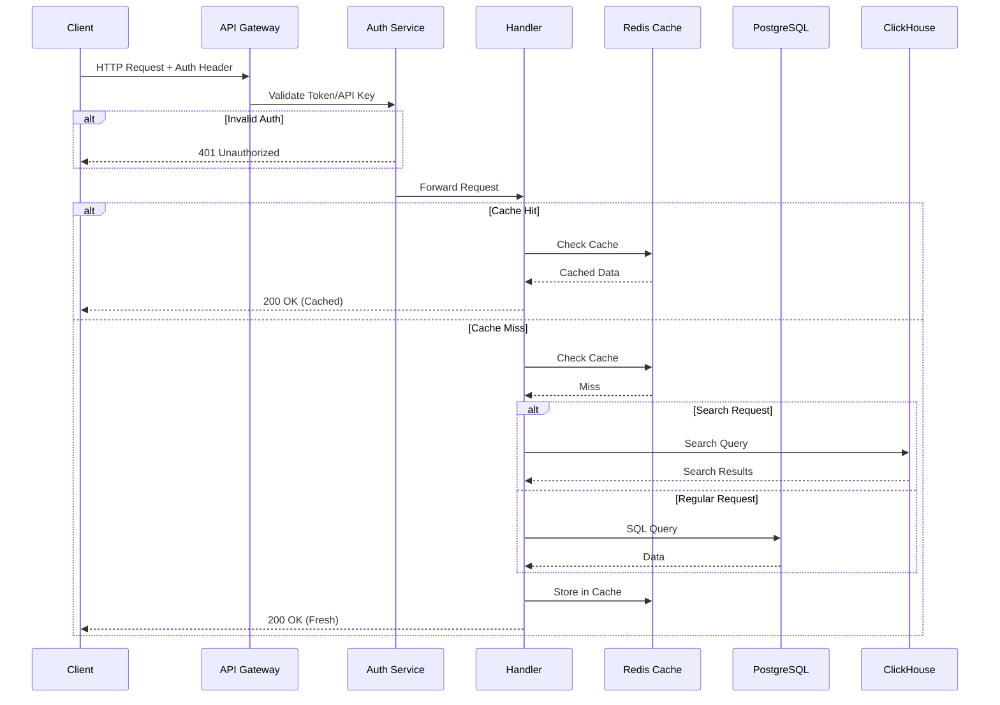
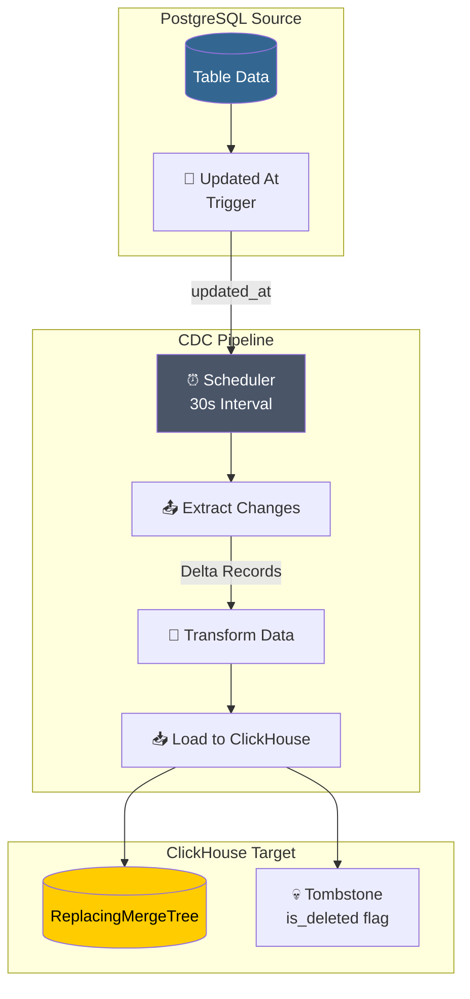
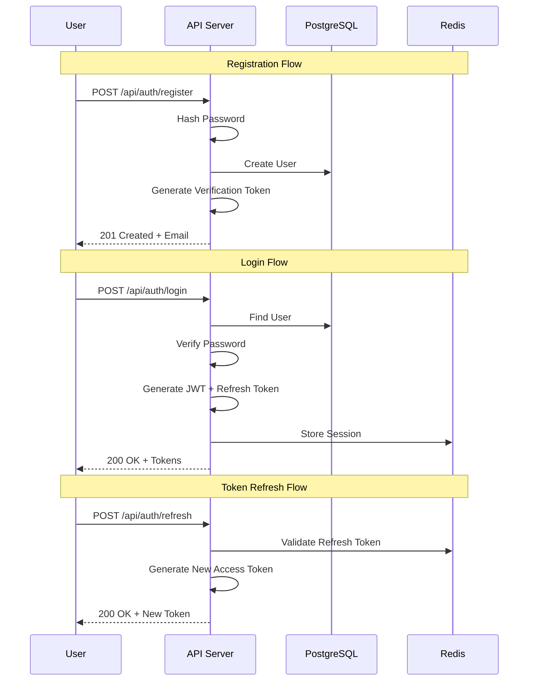
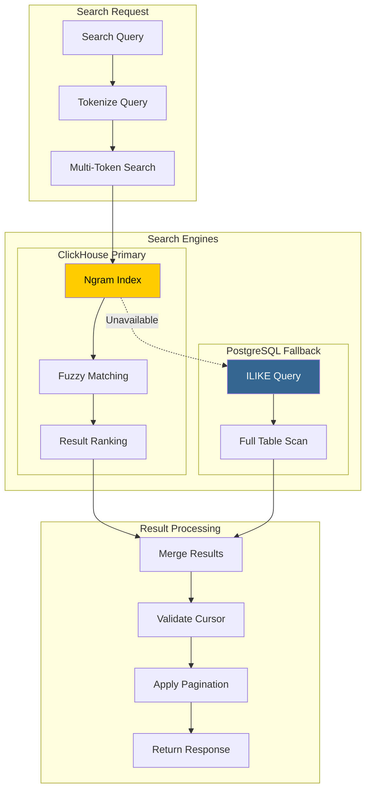
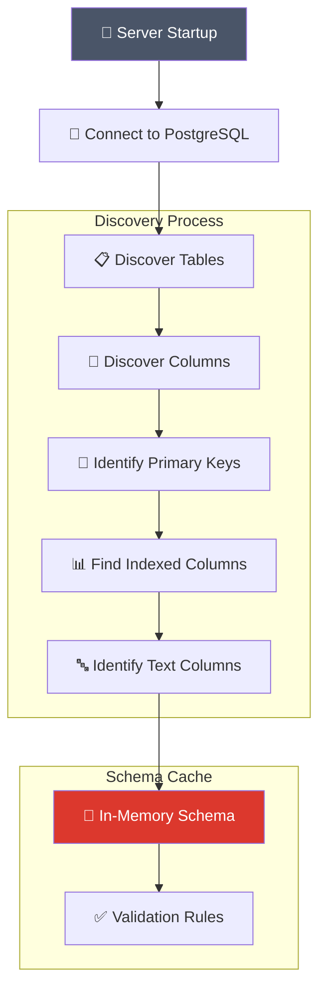
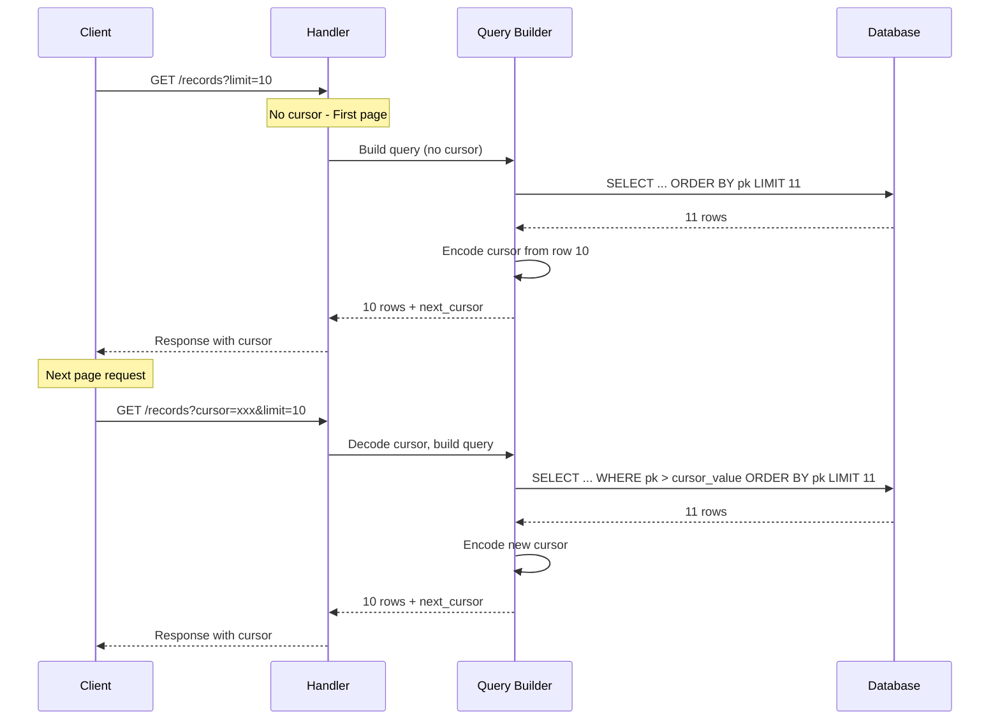
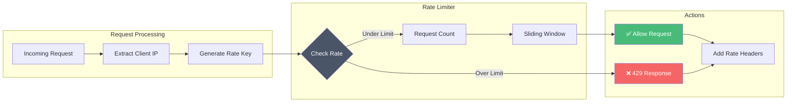
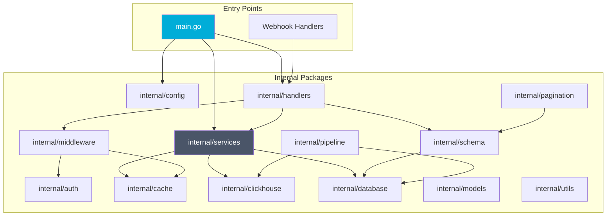

# System Architecture Diagrams

This document contains all Mermaid diagrams for the L.S.D project.

## 1. System Architecture Overview

## 2. Data Flow Diagram

## 3. API Request Flow

## 4. CDC Pipeline Flow

## 5. Authentication Flow

## 6. Search Architecture

## 7. Schema Discovery Process

## 8. Cursor Pagination Flow

## 9. Rate Limiting Architecture

## 10. Component Interaction Map

